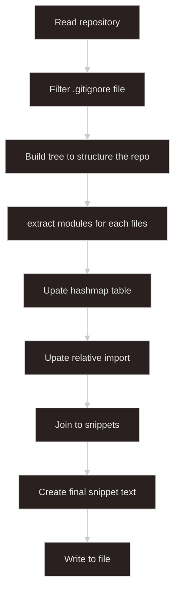

# Repo parser

## Tool to parse repo function and link to related imported function

### Flow chart

```mermaid
---
config:
  theme: neo-dark
  look: classic
---
graph TD
    A[Read repository] --> B[Filter .gitignore file]
    B --> C[Build tree to structure the repo]
    C --> D[extract modules for each files]
    D --> E[Upate hashmap table]
    E --> F[Upate relative import]
    F --> G[Join to snippets]
    G --> H[Create final snippet text]
    H --> I[Write to file]
```
